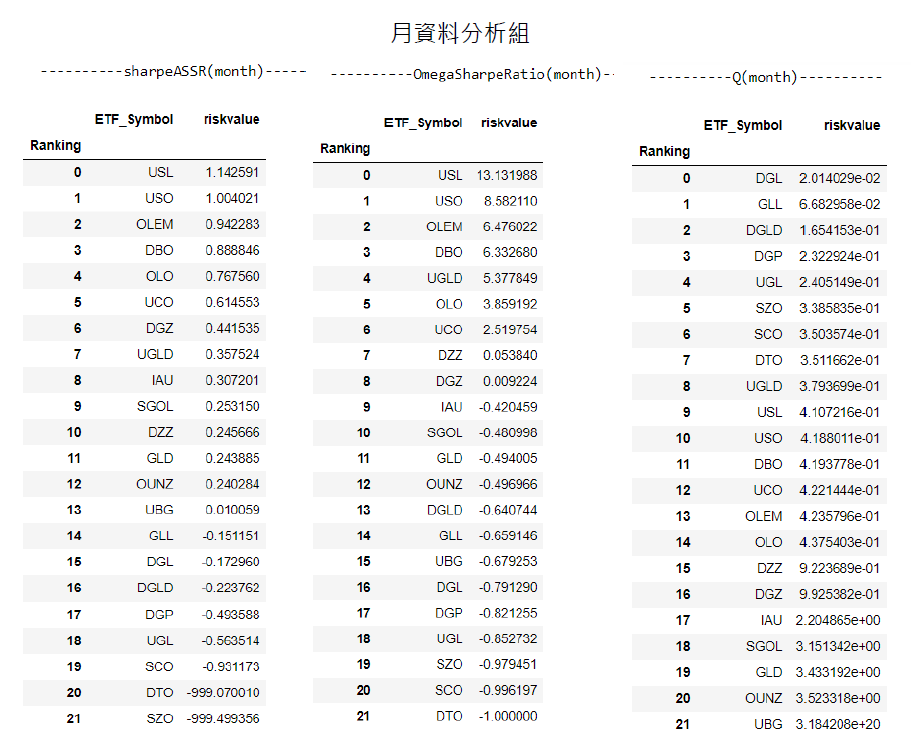

# HW4 ETF評比績效理論實作

## 1. 使用以下3篇論文作為評估ETF之指標的實作

### 評比指標如A,B,C三項
>A.2009_JBF_Portfolio performance evaluation with generalized Sharpe ratios_ASKSR : 使用第38式  
>B.2011_JBF_Omega performance measure and portfolio insurance : 使用第8式，L=無風險利率  
>C.2013_EL_A global index of riskiness : 使用P.494頁中的Q(g)  

---

## 2. 評比規範

### ETF
- Crude Oil ETF List (22)  
- Gold ETF List (17)  

### 時間區間  
- 程式從 Now() 開始回朔至少三年資料 

### 資料週期
- 使用「週資料 」及「月資料分析 」進行評比  

--- 

## 3.評比結果

### 週資料分析組

### 月資料分析組

---

## 4.結論
* 週資料或月結果評比相似嗎? 
大致上很相似，只有少部分ETF排名上下變動的差異，基本上排名不會落差太多。  
* 不同指標評比結果相似嗎?  
A指標(ASSR)與B指標(Omega)評比出來的結果蠻相似的，單看前五名及後五名，可以觀察到其實都是一樣的ETF，排名浮動略微不同。而C指標(Q(g))與前兩者差異有點大。

